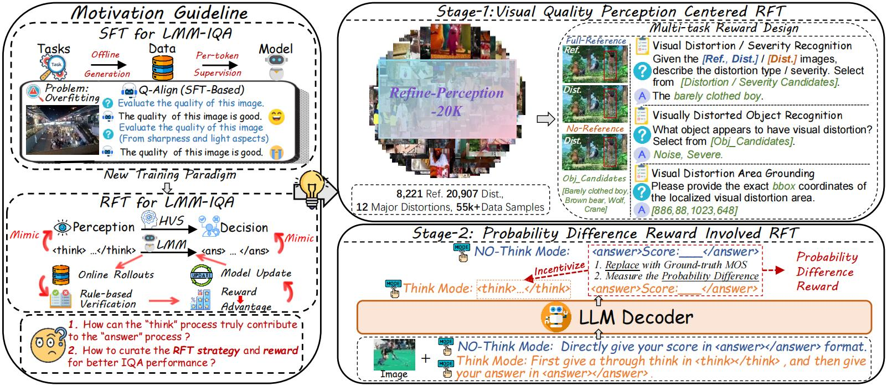
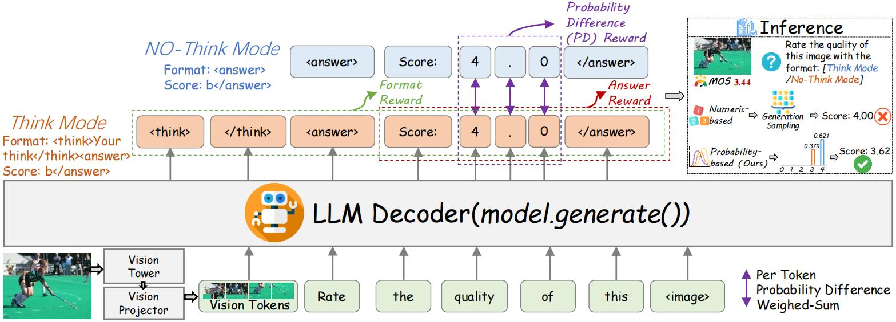

<div align="center">
<div>
    <a href="https://arxiv.org/abs/2508.03763"></a>
   </div>


# VisualQualityAssessment-RL-Trainer
Official released code for Refine-IQA (support vllm training-about ×3 faster)
<div style="width: 100%; text-align: center; margin:auto;">
      
  </div>

<div style="width: 100%; text-align: center; margin:auto;">
      
  </div>
<div align="left">


  
## 🔥🔥🔥Release News
- 🔥[2025/8/15] We have released the training code for Refine-IQA (support vllm)！


  
## 🔖 TODO：
- 🎯[√] Release training code.
- 🎯[] Release test code.
- 🎯[] Release the model weights of Refine-IQA S1 and S2.
- 🎯[] Release the Refine-IQA-Perception-DB.

## 📦Install dependencies:
Install dependencies for standard GRPO (built on trl):
```shell
cd VisualQualityAssessment-RL
conda create -n GRPO python=3.10 -y
conda activate GRPO
pip install -r requirements_standard_RL.txt
```

Install dependencies for GRPO-VLLM (built on trl):
```shell
cd VisualQualityAssessment-RL
conda create -n GRPO-VLLM python=3.10 -y
conda activate GRPO-VLLM
pip install -r requirements_VLLM.txt
**Fix：[2025.08.05] To avoid default device inconsistency, please replace the file **/conda/envs/GRPO-VLLM/lib/python3.10/site-packages/xformers/ops/fmha/__init__.py** to **xformer_replacement/__init__.py**.
```

## 🔎Train your own visual quality assessment model:
Change the trainer_cls in src/open-r1/grpo.py line 448 for your need:

**Qwen2VLGRPOTrainer**: Standard rule-based training

**Qwen2VLGRPOVLLMTrainer**: Standard rule-based training in vllm (×3 faster)

**Qwen2VLGRPOTrainer_Refine**: The training strategy used in Refine-IQA .

Modify the args in **finetune_RL.sh(for standard rule-based training and refine-iqa training)** and **finetune_RL_vllm.sh(for vllm-involved training)**

The example template of training data (**we support both image and video input**) is shown in RL_examples.json

Use the **watchdog.py** for uninterupted training (avoid sudden breakdown)

**Recommanded Device: At least 8×A100(80GB). Please set batch_size_per_device=1 to avoid potential breakdowns.**

## 📎 Citation

If you find the code helpful in your research or work, please cite the following paper(s).

```
@article{jia2025refine,
  title={Refine-IQA: Multi-Stage Reinforcement Finetuning for Perceptual Image Quality Assessment},
  author={Jia, Ziheng and Qian, Jiaying and Zhang, Zicheng and Chen, Zijian and Min, Xiongkuo},
  journal={arXiv preprint arXiv:2508.03763},
  year={2025}
}

```
